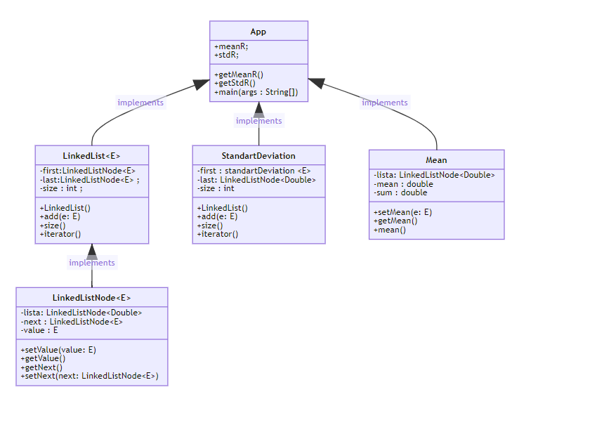

# OODesign
OODesign 225/ 6 = 37.5;
## INTRODUCTION
    Use Maven and GITHUB.

Write a program to calculate the mean and standard deviation of a set of n real
numbers.
Your program reads the n real numbers from a file.
Use a linked list to store the n numbers for the calculations. (Note: You have
to write your own implementation of a linked list and it must be compliant
with Java’s collections API)
## Tests
This project includes tests that are located in
```
edu.escuelaing.arsw.AppTest
```
## Installation

in root folder please run:
```
MVN Package
```
## Run Project
You can run the project running the following commands:
```
example2.txt
```

```
example.txt
```

## Class Diagram


[]()

In the class diaram you can seea main class that is App.java, that uses PhyClass and LocClass.

**LinkedList**
Is the repersentation of the linked list, you can send any kind of object

**LinkedListNode**
Represents the position of the list, or tthe node
**Standart deviation**
allows get the standart deviation of the linkedlist, it needs to use the Mean class
**Mean**
allows get the mean of the linkedlist

**App**
- is the main app class

02/June/2021


## License

MIT

**Nicolás Torres Páez**
**colombia school of engineering Julio Garavito**

